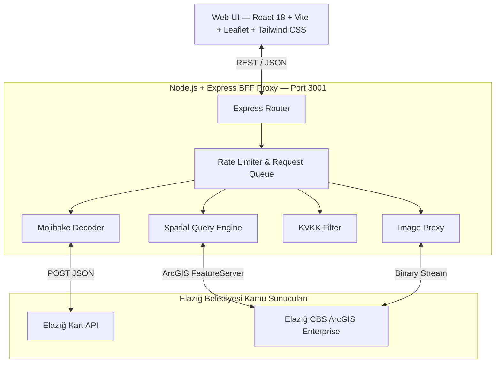

# Elazığ Şehir Bilgi Sistemi

Elazığ Belediyesi'nin iki bağımsız kamu veri altyapısını tek bir modern ve interaktif platformda birleştiren açık kaynak Kent Bilgi ve Canlı Toplu Taşıma Sistemi.

[](https://crowroser.github.io/elazig-sehir-bilgi-sistemi/)
[](LICENSE)

---

## Proje Hakkında

Bu proje, Elazığ Belediyesi'ne ait birbirinden bağımsız çalışan iki kamu servisini (**Elazığ Kart Ulaşım API** ve **Elazığ CBS ArcGIS Enterprise**) tersine mühendislik ile analiz ederek modern web standartlarında birleştiren tam işlevsel bir Şehir Bilgi Sistemidir.

Sistem, 1.286 aktif otobüs durağında canlı araç takibi, 45 mahallenin sınır ve muhtarlık bilgileri, 141.950 numarataj kaydı ve 130 acil durum toplanma alanını tek bir harita arayüzünde sunar.

### Çözülen Teknik Zorluklar

- **Karakter Kodlama Onarımı** — Upstream API'nin Windows-1254 / ISO-8859-9 bozuk yanıtları otomatik algılanıp Buffer binary fallback ile düzeltilir.
- **Koordinat Doğrulama** — Veritabanındaki sahte/test durakları (D1–D42) coğrafi sınır filtresi ile ayıklanır.
- **Akıllı Türkçe Arama** — Karakter dönüşümleri (ç/c, ğ/g, ı/i, ö/o, ş/s, ü/u) ve birleşik/ayrık yazım varyasyonları otomatik genişletilir.
- **Fotoğraf Proxy** — CBS sunucusunun Referer koruması, backend binary proxy ile aşılarak saha fotoğrafları sunulur.
- **KVKK Uyumluluk** — CBS katmanlarındaki kişisel kimlik alanları (`tc_kimlik`, `ana_ad`, `baba_adi`) filtrelenir.

---

## Temel Özellikler

### Canlı Otobüs Takip
- 1.286 aktif durak üzerinde arama ve canlı hat takibi
- GPS ile en yakın 5 durağı metre cinsinden hesaplama
- Hareket halindeki otobüslerin plaka, hız, pusula, sürücü ve doluluk bilgileri
- Gidiş/dönüş güzergah çizimi ve sefer saatleri çizelgesi
- Güncel bilet fiyat tarifesi (Tam, İndirimli, Öğrenci)

### Kent Bilgi Sistemi (CBS)
- Haritada herhangi bir noktaya tıklayarak yapı, kadastro, mahalle ve adres bilgisi sorgulama
- Bina detayları: kat sayısı, bağımsız bölüm, asansör, otopark, yapı sınıfı, taban alanı
- 45 mahalle sınır haritası, muhtar iletişim bilgileri ve bina/kapı istatistikleri
- 141.950 numarataj kaydında adres ve kapı arama
- Saha tespit fotoğrafları galerisi ve tam ekran önizleme

### Acil Durum Toplanma Alanları
- 130 resmi toplanma alanı, engelli uygunluğu, su, WC ve elektrik filtreleri
- Kullanıcı konumuna en yakın toplanma alanı hesabı ve yol tarifi

### Harita
- OpenStreetMap ve Esri uydu görüntüsü katmanları
- Katmanlar arası izolasyon ve otomatik temizlik

---

## Sistem Mimarisi



---

## API Dokümantasyonu

Tüm REST servisleri OpenAPI 3.0 standartlarında dokümante edilmiştir.

- **Swagger UI:** `http://localhost:3001/api-docs`
- **OpenAPI JSON:** `http://localhost:3001/api-docs.json`

| Kategori | Endpoint | Açıklama |
|---|---|---|
| Otobüs | `GET /api/bus/stations` | Tüm aktif duraklar (~1.286) |
| Otobüs | `GET /api/bus/stations/nearest` | En yakın duraklar |
| Otobüs | `GET /api/bus/station/:id/remaining` | Duraktan geçen hatlar ve kalan süre |
| Otobüs | `GET /api/bus/route/:code/realtime` | Canlı otobüs konumları |
| Otobüs | `GET /api/bus/route/:code/schedule` | Sefer saatleri |
| Otobüs | `GET /api/bus/route/:code/price` | Ücret tarifesi |
| Otobüs | `GET /api/bus/route/:code/stops` | Hat durak listesi |
| Otobüs | `GET /api/bus/route/:code/coordinates` | Güzergah polyline |
| Otobüs | `GET /api/bus/route/:code/overview` | Birleşik hat özeti |
| CBS | `GET /api/cbs/identify` | Haritadan tıklanan nokta verisi |
| CBS | `GET /api/cbs/neighborhoods` | 45 Mahalle ve muhtarlık rehberi |
| CBS | `GET /api/cbs/search/address` | Numarataj ve kapı arama |
| CBS | `GET /api/cbs/search/building` | Ada/Parsel ve yapı sorgulama |
| CBS | `GET /api/cbs/building/:id/attachments` | Bina saha fotoğrafları |
| CBS | `GET /api/cbs/green-areas` | Park ve yeşil alanlar |
| CBS | `GET /api/cbs/poi` | Önemli noktalar |
| Acil | `GET /api/cbs/emergency-assembly` | 130 Toplanma alanı |
| Sistem | `GET /api/health` | API bağlantı durumu |
| Sistem | `GET /api/stats` | Kent istatistikleri |

---

## Hızlı Kurulum

### Gereksinimler
- Node.js v18+ (önerilen: v20 veya üzeri)
- npm v9+

### Kurulum

```bash
# Projeyi klonlayın
git clone https://github.com/crowroser/elazig-sehir-bilgi-sistemi.git
cd elazig-sehir-bilgi-sistemi

# Bağımlılıkları yükleyin
npm install
npm install --prefix client

# Geliştirme modunda başlatın (Backend: 3001, Frontend: 5173)
npm run dev
```

### Production

```bash
# Frontend'i derleyin
npm run build --prefix client

# Tek sunucu üzerinden başlatın
npm start
```

### Docker

```bash
docker build -t elazig-kbs .
docker run -d -p 3001:3001 --name elazig-kbs elazig-kbs
```

---

## Kullanılan Teknolojiler

| Kategori | Teknoloji |
|---|---|
| Frontend | React 18, Vite 5, Tailwind CSS, Leaflet |
| Backend | Node.js, Express, OpenAPI 3.0 / Swagger UI |
| Harita | OpenStreetMap, Esri World Imagery |
| CI/CD | GitHub Actions, GitHub Pages |
| Container | Docker (multi-stage Alpine build) |

---

## Katkıda Bulunma

Katkılarınızı memnuniyetle karşılıyoruz! Yeni özellik önerileri, hata bildirimleri veya pull request'ler için GitHub Issues bölümünü kullanabilirsiniz.

1. Projeyi fork edin
2. Feature branch oluşturun (`git checkout -b feature/yeni-ozellik`)
3. Değişikliklerinizi commit edin (`git commit -m 'Yeni özellik eklendi'`)
4. Branch'i push edin (`git push origin feature/yeni-ozellik`)
5. Pull Request oluşturun

---

## Lisans ve Yasal Uyarı

Bu proje [MIT Lisansı](LICENSE) ile lisanslanmıştır.

Bu yazılım, kamuya açık Elazığ Belediyesi verilerini vatandaş odaklı kolaylaştırmak amacıyla geliştirilmiş bağımsız bir açık kaynak projesidir. 6698 sayılı Kişisel Verilerin Korunması Kanunu (KVKK) kapsamında hiçbir özel kimlik bilgisi işlenmez veya saklanmaz.

---

<div align="center">

**Muhammed Fatih Gülcü** · Elazığ Şehir Bilgi Sistemi © 2026

</div>
