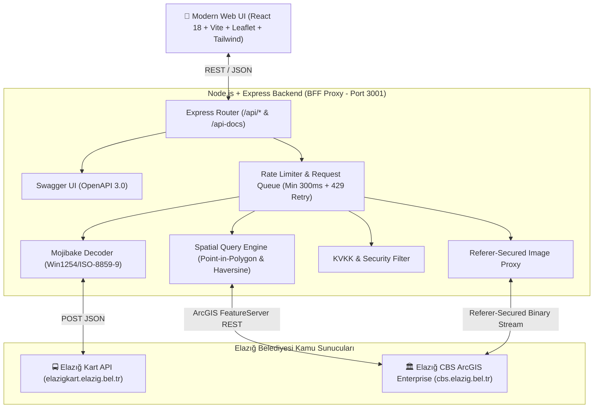

<div align="center">

# 🏙️ Elazığ Şehir Bilgi Sistemi (KBS & Canlı Otobüs Takip)

**Elazığ Belediyesi'nin iki bağımsız kamu veri altyapısını tek bir modern, hızlı ve interaktif platformda birleştiren açık kaynak Kent Bilgi ve Canlı Toplu Taşıma Sistemi.**

[](https://nodejs.org/)
[](https://react.dev/)
[](https://vitejs.dev/)
[](https://tailwindcss.com/)
[](https://leafletjs.com/)
[](http://localhost:3001/api-docs)
[](LICENSE)

[🌐 Canlı Demo](#-canlı-demo--önizleme) • [✨ Özellikler](#-temel-özellikler) • [📚 API Dokümantasyonu (Swagger)](#-api-dokümantasyonu-ve-swagger-ui) • [🚀 Kurulum & Çalıştırma](#-hızlı-kurulum) • [🏗️ Mimari](#️-sistem-mimarisi)

</div>

---

## 📌 Proje Hakkında (About)

Bu proje, Elazığ Belediyesi'ne ait birbirinden tamamen bağımsız çalışan iki kamu servisini (**Elazığ Kart Ulaşım API** ve **Elazığ CBS ArcGIS Enterprise API**) tersine mühendislik ile analiz ederek modern web standartlarında birleştiren uçtan uca tam işlevsel bir Şehir Bilgi Sistemidir.

### 🎯 Çözülen Temel Zorluklar ve Edge-Case Çözümleri:
1. **Mojibake & Karakter Kodlama Onarımı:** `activestation` servisinin bazı durumlarda Windows-1254 / ISO-8859-9 ikili baytları UTF-8 olarak bozuk döndürmesi sorunu, Buffer binary fallback mekanizması ile çözüldü.
2. **Koordinat Normalizasyonu & Bounding Box Filtresi:** Veritabanındaki sahte/test durakları (`D1`..`D42`, 39.1+ enlem), Elazığ coğrafi sınırları (`38.45-38.90 N`, `38.95-39.45 E`) ile filtrelenerek 1.286 doğrulanmış durağa indirgendi.
3. **Akıllı Türkçe Arama (Fuzzy Search):** Türkçe karakter (`ç/c`, `ğ/g`, `ı/i`, `ö/o`, `ş/s`, `ü/u`) ve birleşik/ayrık yazım varyasyonları (`ÇAYDAÇIRA` ⟷ `ÇAYDA ÇIRA`, `DOĞUKENT` ⟷ `DOĞU KENT`, `ABDULLAHPAŞA` ⟷ `ABDULLAH PAŞA`) otomatik genişletilerek adres ve mahalle aramalarında %100 eşleşme sağlandı.
4. **Haritadan Tıklanan Noktanın Canlı CBS Tespiti (Spatial Identify):** Haritada herhangi bir noktaya tıklandığında; poligon içi bina (`Layer 8`), kadastro ada/parsel (`Layer 3`), mahalle/muhtarlık (`Layer 5`), en yakın kapı/numarataj (`Layer 7`) ve en yakın acil toplanma alanı paralel sorgulanır.
5. **Referer Korumalı Fotoğraf Proxy'si:** CBS sunucusunun yalnızca kendi arayüzünden gelen resim isteklerine izin veren `Referer` kısıtlaması, backend binary proxy ile aşılarak saha tespit fotoğrafları galeri ve lightbox olarak sunuldu.
6. **KVKK & Veri Güvenliği Uyumluluğu:** CBS katmanlarındaki kişisel kimlik alanları (`tc_kimlik`, `ana_ad`, `baba_adi`) kesin olarak filtrelenerek sadece yasal yapısal öznitelikler sunulur.

---

## ✨ Temel Özellikler

### 1. 🚌 Canlı Otobüs Takip (Elazığ Kart)
- **1.286 Aktif Durak:** Durak adına veya numarasına göre anlık arama, durağa göre geçen hatlar.
- **📍 GPS ile En Yakın Duraklar:** Kullanıcının konumuna en yakın 5 durağı metre cinsinden mesafe ile listeleme.
- **⚡ Canlı GPS Araç Takibi:** Hareket halindeki otobüslerin plaka, anlık hız, pusula açısına göre dönen yön oku, renk kodu, sürücü ve anlık yolcu/doluluk bilgileri.
- **🗺️ Çift Yönlü Güzergah Polyline:** Gidiş ve Dönüş güzergahlarının haritada interaktif çizimi.
- **📅 Sefer Saatleri & Kalan Süre:** Günlük kalkış saatleri çizelgesi ve sıradaki 3 hareket saati.
- **💳 Güncel Fiyat Tarifesi:** Tam, İndirimli ve Öğrenci/Öğretmen bilet fiyatları.

### 2. 🏛️ Kent Bilgi Sistemi (Elazığ CBS)
- **📍 Haritaya Tıklayarak Canlı Sorgu (Identify):** Haritada herhangi bir binaya, arsaya veya caddeye tıklandığında imar, kadastro ve adres bilgilerinin anında listelenmesi.
- **🏢 Yapı (Bina) Bilgileri:** Kat sayısı (zemin üstü/altı), bağımsız bölüm (mesken & işyeri), asansör, otopark, yangın merdiveni, yapı sınıfı, dış cephe ve taban alanı $m^2$.
- **📐 Kadastro Sorgulama:** Mahalle, Ada No, Parsel No, Ada/Parsel formatı ve parsel alanı.
- **📸 Saha Tespiti Fotoğraf Galerisi & Lightbox:** Binalara ve numarataj noktalarına ait saha fotoğraflarının tam ekran önizlemesi.
- **🏡 45 Mahalle & Muhtar Rehberi:** 45 mahallenin sınır poligonları, bina/kapı istatistikleri ve tek tıkla muhtarı arama (`tel:`).
- **🚪 Numarataj & Kapı Arama:** 141.950 kapı kaydı içerisinden hızlı arama ve haritada odaklanma.

### 3. 🚨 Acil Durum & Toplanma Alanları
- **130 Resmi Toplanma Alanı:** Elazığ genelindeki tüm afet ve acil durum toplanma alanları.
- **Filtreler & Donanım Durumu:** ♿ Engelli Uygunluğu, 💧 İçme Suyu, 🚻 WC, ⚡ Elektrik donanımlarına göre anında filtreleme.
- **Mesafe Hesabı & Rota:** Kullanıcının konumuna veya haritadaki noktaya en yakın toplanma alanının metre cinsinden hesabı.

### 4. 🗺️ Harita Özellikleri (Leaflet & OpenStreetMap)
- **%100 Açık Kaynak Harita:** API anahtarı veya kota kısıtlaması bulunmayan OpenStreetMap altlığı.
- **🛰️ Uydu Görüntüsü Geçişi:** Tek tıkla Esri World Imagery yüksek çözünürlüklü uydu haritasına geçiş.
- **Katı Katman İzolasyonu & 🧹 Temizle:** Sekmeler arası geçişlerde işaretlemelerin karışmasını engelleyen otomatik temizlik ve manuel sıfırlama butonu.

---

## 📚 API Dokümantasyonu ve Swagger UI

Projede yer alan tüm REST servisleri **OpenAPI 3.0.0** standartlarında dokümante edilmiştir.

- **Swagger UI Arayüzü:** `http://localhost:3001/api-docs` (veya `/swagger`)
- **OpenAPI JSON:** `http://localhost:3001/api-docs.json`

```
┌─────────────────────────────────────────────────────────────────────────────┐
│ ELAZIĞ ŞEHİR BİLGİ SİSTEMİ REST API ENDPOINT'LERİ (18 Endpoint)             │
├─────────────────────────────────────────────────────────────────────────────┤
│ 🚌 OTOBÜS & ULAŞIM                                                          │
│   GET /api/bus/stations                  Tüm aktif duraklar (~1.286)        │
│   GET /api/bus/stations/nearest          En yakın duraklar (lat, lng)       │
│   GET /api/bus/station/:id/remaining     Duraktan geçen hatlar & kalan süre │
│   GET /api/bus/route/:code/realtime      Canlı otobüs konumları & hız/yolcu │
│   GET /api/bus/route/:code/schedule      Sefer saatleri & sıradaki kalkış   │
│   GET /api/bus/route/:code/price         Ücret tarifesi                     │
│   GET /api/bus/route/:code/stops         Hattın durak listesi               │
│   GET /api/bus/route/:code/coordinates   Güzergah polyline çizgileri        │
│   GET /api/bus/route/:code/overview      Birleşik hat özeti                 │
├─────────────────────────────────────────────────────────────────────────────┤
│ 🏛️ KENT BİLGİ SİSTEMİ (CBS)                                                │
│   GET /api/cbs/identify                  Haritadan tıklanan nokta CBS verisi│
│   GET /api/cbs/neighborhoods             45 Mahalle & Muhtar rehberi        │
│   GET /api/cbs/search/address            Numarataj & Kapı No arama          │
│   GET /api/cbs/search/building           Ada/Parsel & Yapı sorgulama        │
│   GET /api/cbs/building/:id/attachments  Bina saha fotoğrafları listesi     │
│   GET /api/cbs/attachment/:l/:o/:a       Referer korumalı resim proxy'si    │
│   GET /api/cbs/green-areas               Parklar ve yeşil alanlar           │
│   GET /api/cbs/poi                       Önemli noktalar (POI)              │
├─────────────────────────────────────────────────────────────────────────────┤
│ 🚨 ACİL DURUM                                                               │
│   GET /api/cbs/emergency-assembly        130 Acil durum toplanma alanı      │
├─────────────────────────────────────────────────────────────────────────────┤
│ ⚙️ SİSTEM SAĞLIK & İZLEME                                                   │
│   GET /api/health                        Belediye API bağlantı & gecikme    │
└─────────────────────────────────────────────────────────────────────────────┘
```

---

## 🏗️ Sistem Mimarisi



---

## 🚀 Hızlı Kurulum

### Gereksinimler:
- **Node.js**: v18.x veya üzeri (Önerilen: v20.x / v22.x / v24.x)
- **npm**: v9.x veya üzeri

### 1. Projeyi Klonlayın
```bash
git clone https://github.com/mfatihgulcu/elazig-sehir-bilgi-sistemi.git
cd elazig-sehir-bilgi-sistemi
```

### 2. Bağımlılıkları Yükleyin
```bash
# Kök dizin (Backend) bağımlılıkları
npm install

# Frontend (Client) bağımlılıkları
npm install --prefix client
```

### 3. Geliştirme (Development) Modunda Başlatın
```bash
# Backend (Port 3001) ve Frontend (Port 5173) eşzamanlı başlar
npm run dev
```

### 4. Üretim (Production) Derlemesi & Çalıştırma
```bash
# Frontend'i derleyin
npm run build --prefix client

# Tek sunucu üzerinden hem API'yi hem Web Sitesini başlatın
npm start
```
Tarayıcınızda açın: **[http://localhost:3001](http://localhost:3001)**

---

## 🐳 Docker ile Çalıştırma

```bash
# Docker imajını oluşturun
docker build -t elazig-kbs .

# Konteyneri başlatın
docker run -d -p 3001:3001 --name elazig-kbs-app elazig-kbs
```

---

## 🛠️ Kullanılan Teknolojiler

| Kategori | Teknoloji | Açıklama |
|---|---|---|
| **Frontend** | React 18 | Bileşen tabanlı kullanıcı arayüzü |
| **Derleme Aracı** | Vite 5 | Hızlı HMR ve optimize edilmiş production bundle |
| **Harita** | Leaflet & React-Leaflet | İnteraktif harita, özel SVG/DivIcon pinler, poligonlar |
| **Stil / UI** | Tailwind CSS | Modern karanlık tema (Dark Mode) ve responsive grid |
| **İkonlar** | Lucide React | Modern arayüz ikon seti |
| **Backend** | Node.js & Express | REST API, Backend-for-Frontend (BFF), reverse proxy |
| **Dokümantasyon**| Swagger UI & OpenAPI 3.0 | İnteraktif API test ve dokümantasyon paneli |
| **Performans** | Compression & Node Cache | Gzip sıkıştırma ve bellek içi veri önbellekleme |

---

## 📄 Lisans & Yasal Uyarı

- Bu proje **MIT Lisansı** ile lisanslanmıştır.
- Bu yazılım kamuya açık Elazığ Belediyesi verilerini vatandaş odaklı kolaylaştırmak amacıyla geliştirilmiş bağımsız bir açık kaynak projesidir.
- Projede 6698 sayılı **Kişisel Verilerin Korunması Kanunu (KVKK)** kapsamında vatandaşlara ait hiçbir özel kimlik bilgisi işlenmez ve saklanmaz.

---

<div align="center">
Geliştirici: <b>Muhammed Fatih Gülcü</b> • Elazığ Şehir Bilgi Sistemi © 2026
</div>
